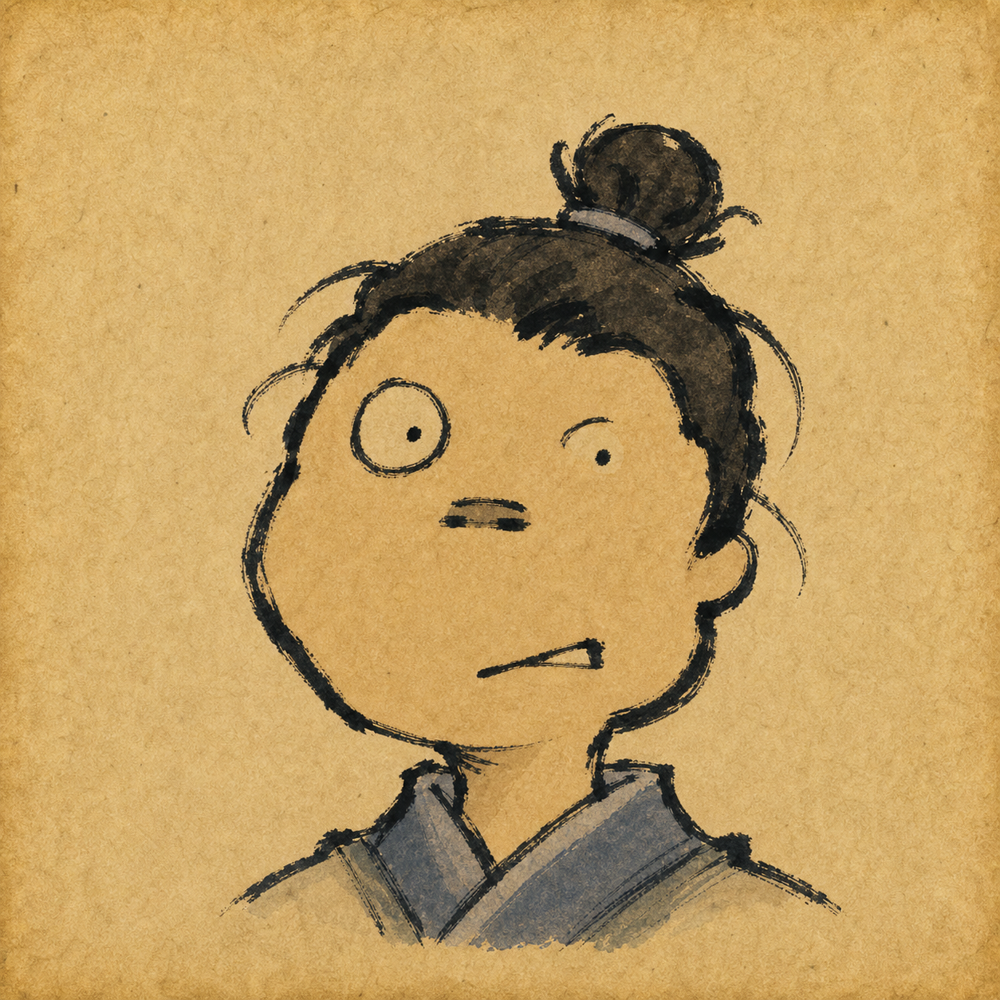
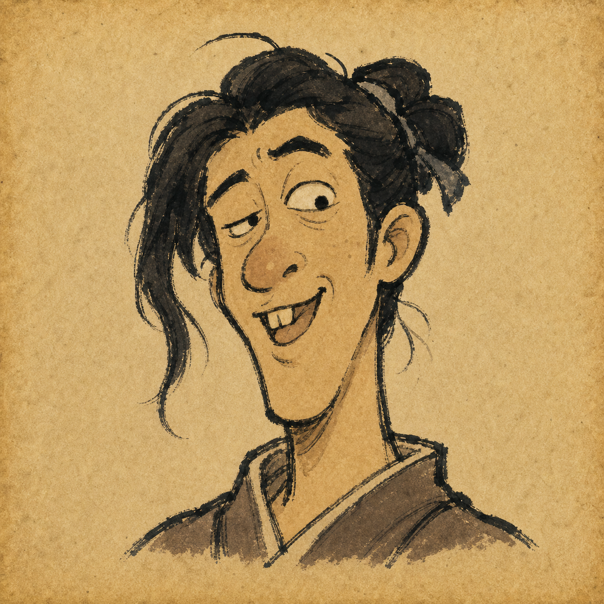
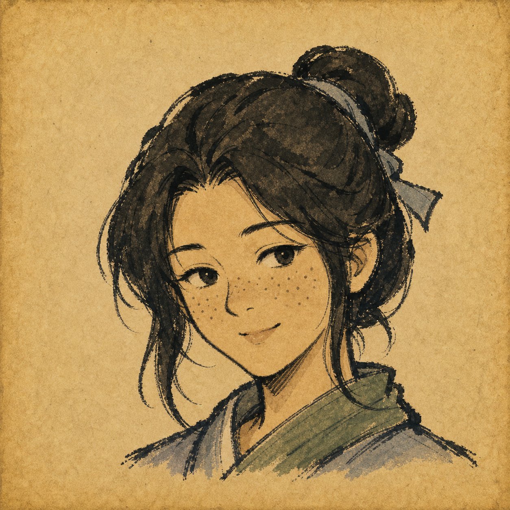
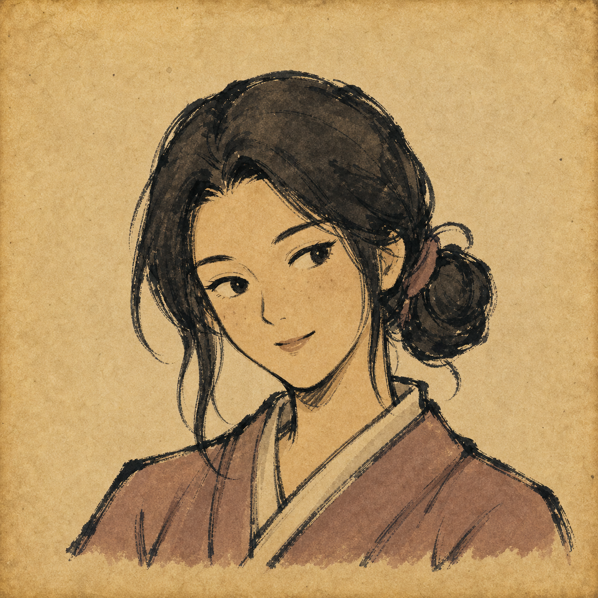
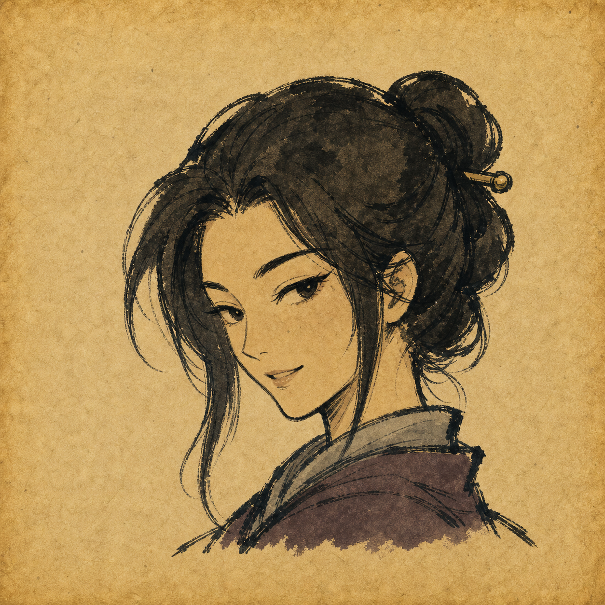
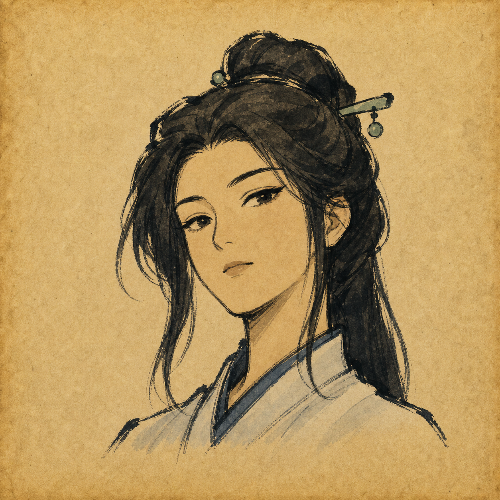

# Character Portrait Style

This document is the project-facing summary for character avatar portraits. The operational generation and QA workflow lives in `.codex/skills/wuxia-avatar-portrait-pipeline/`.

## Current State

Current locked set: `wuxia-avatar-beauty-scale-v4`

Canonical source images live only in:

`docs/assets/character-portraits/wuxia-avatar-beauty-scale-v4/originals/`

These originals are locked. Do not crop, redraw, downsample, overwrite, or replace them inside v4 unless the user explicitly provides a replacement for that exact score. Any new style or identity change starts a new iteration, normally `wuxia-avatar-beauty-scale-v5`.

Only full-size originals are stored as canonical assets. Thumbnail folders, contact sheets, preview grids, and rejected candidates are disposable QA artifacts and should not be treated as source assets.

## Locked V4 Originals

| Score | Face/personality target | Canonical original |
| --- | --- | --- |
| 0 | abstract comedy Jianghu face, lopsided zero-attractiveness gag |  |
| 2 | human-ish comic crooked face, foolish smug grin |  |
| 4 | cute pure herb-runner type, clear freckles and slightly upturned nose, still harmonious |  |
| 6 | pleasant tea-house disciple, clear open smile, balanced normal appeal |  |
| 8 | fox-like inn spy, teasing smirk, sly charm |  |
| 10 | high-cold immortal sword disciple, direct cold gaze, top-tier facial harmony |  |

## Visual Style

- Square `1:1` parchment avatar portrait.
- Rough old Chinese wuxia mobile-game portrait feeling.
- Thick uneven black ink brush lines, dry-brush texture, controlled roughness.
- Muted flat watercolor wash on aged tan rice paper.
- Low-to-moderate detail: broad hair masses, sparse costume folds, simple accessories.
- Jianghu clothing only: cloth robes, collars, scarves, simple hairpins, small weapon hints when needed.
- No UI frame, text, watermark, logo, scenery, modern props, 3D render, photorealism, polished anime cleanup, or ornate fantasy armor.

## V5+ Hard Composition Rules

The locked v4 originals are exempt from later framing rules. For any new v5+ portrait:

- Face plus hair should occupy about `84-90%` of the square height.
- Clothing should be only a narrow collar strip plus tiny shoulder hints in the bottom `6-12%`.
- Explicit over-shoulder or back-turn views may allow collar/shoulder mass up to `18%`, but must still read as a head-and-collar avatar.
- Do not show chest, torso mass, waist, broad shoulders, arms, hands, forearms, elbows, full sleeves, or action-pose limbs.
- Do not erase clothing into a floating head; preserve neck, neckline, collar, and tiny shoulder tips.
- Do not crop off hair buns, ornaments, chin, or shoulder tips.

## Angle And Face Diversity

Avoid letting a set collapse into repeated same-side 45-degree half-profile portraits. For any group of three or more portraits, require at least two clearly different angle families, such as:

- strict symmetrical front
- near-front with downward tilt
- slight top-down front
- slight low-angle front
- lifted chin with direct gaze
- reverse-direction over-the-shoulder
- turned head that is not the same default 45-degree view

Beauty and personality must come from facial structure and expression, not clothing luxury. Vary face shape, eyes, brows, nose, mouth, expression, hair silhouette, and angle between nearby scores.

## Score Semantics

- `0`: abstract comedy gag, almost non-attractive, still parchment ink style.
- `2`: human-ish comic distortion, intentionally goofy and unattractive.
- `4`: normal and cute or pure overall, with visible flaws such as freckles and a slightly upturned nose. Should not become refined beauty.
- `6`: pleasant, approachable, normal attractive.
- `8`: clearly beautiful with distinct charm, such as sly, fox-like, lively, or teasing.
- `10`: strongest facial harmony and presence, cold, iconic, commanding, or immortal-like.

The v4 locked set currently covers scores `0`, `2`, `4`, `6`, `8`, and `10`. Missing odd scores should be generated in a later iteration instead of filled by resurrecting discarded exploration assets.

## Prompt Source

Use the prompt template and strict blocks in:

`.codex/skills/wuxia-avatar-portrait-pipeline/references/v4-style-lock.md`

Every new v5+ prompt should include:

- `STRICT COMPOSITION`
- one applicable `STRICT ANGLE` block
- a face-diversity line explaining how this character differs from nearby portraits

## QA Policy

Use the project skill QA script for canonical sets:

```bash
.codex/skills/wuxia-avatar-portrait-pipeline/scripts/qa-portrait-set.sh \
  --out reports/portrait-jobs/<slug>/qa \
  docs/assets/character-portraits/<iteration>/originals/*.png
```

Inspect the contact sheet and any questionable image manually. Reject or regenerate if the portrait fails square-ratio, crop safety, rough brushwork, head-and-collar framing, upper-body limits, angle diversity, face diversity, or score/personality intent.

Do not document local generated-image cache paths or temporary paths. Project docs should use repository-relative paths only.
