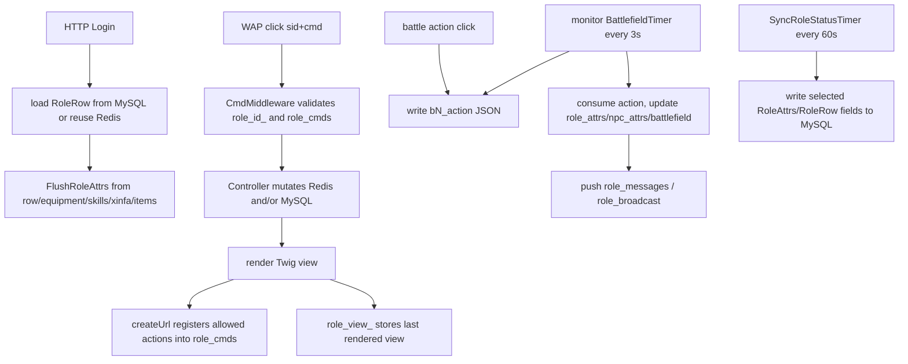

# 《夺宝中华》WAP MUD 调研：玩法、养成、同步与持久化

本文记录对 `/Users/nomofu/Downloads/20231026/game` 的代码阅读细节。重点不是 WAP 页面样式，而是它作为长线武侠 MUD 的玩法建模、运行时同步和落盘方式，以及对当前 Haskell MUD 的可借鉴点。

综合结论与后续落地路线见 [MUD 调研综合结论与落地路线](./mud-design-synthesis.md)。本文保留为《夺宝中华》侧的证据和参考。

## 一句话结论

《夺宝中华》是一个 PHP/Workerman + Redis + MySQL 的点击式 WAP MUD。MySQL 保存账号、角色、技能、背包、心法、地图和静态内容；Redis 承担在线会话、角色热状态、战斗槽、地图在线玩家、地图掉落、消息队列和静态表热缓存；独立 monitor 进程用定时器推进战斗、心法经验、NPC 刷新、地图物件过期和角色写回。

它最值得借鉴的是长线养成建模和“请求写意图、定时器推进世界”的同步形态，不值得照搬的是 Redis key 任意拼接、PHP 对象序列化、硬编码门派规则和宽表式招式字段。

## 架构轮廓

- HTTP 入口在 `/Users/nomofu/Downloads/20231026/game/app.php`，Workerman 启动多个 HTTP worker，经过 `CmdMiddleware` / `RouteMiddleware` 后分发到控制器。
- 定时器入口在 `/Users/nomofu/Downloads/20231026/game/monitor.php`，负责战斗、NPC、地图物件、角色同步、心法经验、离线清理等慢速/周期性逻辑。
- Redis 连接使用 PHP serializer，缓存里直接放 `RoleRow`、`RoleAttrs`、`NpcAttrs` 等对象。
- MySQL 通过 PDO 直接查询/更新；后台 admin 是内容编辑器，静态世界表启动时装入 Redis。

关键代码入口：

- `/Users/nomofu/Downloads/20231026/game/App/Http/Controllers/User/LoginController.php`
- `/Users/nomofu/Downloads/20231026/game/App/Http/Middleware/CmdMiddleware.php`
- `/Users/nomofu/Downloads/20231026/game/App/Core/Components/App.php`
- `/Users/nomofu/Downloads/20231026/game/App/Libs/Attrs/FlushRoleAttrs.php`
- `/Users/nomofu/Downloads/20231026/game/App/Libs/Events/Timers/SyncRoleStatusTimer.php`
- `/Users/nomofu/Downloads/20231026/game/App/Libs/Events/Timers/ClearOfflineRoleTimer.php`
- `/Users/nomofu/Downloads/20231026/game/App/Libs/Events/Timers/BattlefieldTimer.php`
- `/Users/nomofu/Downloads/20231026/game/App/Libs/Events/Timers/Battlefield/PlayerKillNPC.php`

## 玩法与养成建模

### 1. 角色拆成持久行和派生属性

`RoleRow` 是长期数据：账号、sid、门派、师父、辈分、地图、经验、潜能、精神、金钱、仓库、击杀、红名、任务、双倍/三倍 buff 等。

`RoleAttrs` 是运行期派生数据：HP/MP 上限、当前 HP/MP、攻击、防御、闪避、招架、装备贡献、技能贡献、心法贡献、战斗状态、复活时间等。

`FlushRoleAttrs` 统一从 `RoleRow`、装备、技能、心法和背包重量重算派生属性。这是当前 Haskell 项目最应该吸收的结构：增加显式 `DerivedStats` / `RuntimeStats` 层，避免把装备、武功、buff、心法的加成散落在战斗代码里。

### 2. 武学不是技能按钮，而是基础功 + 专精映射

技能分为基础武学和特殊武学，类别包括拳脚、刀法、剑法、内功、轻功、招架。基础功上可以设置一个特殊武学：

- 当前武器是剑，就用基础剑法 + 映射剑法计算攻击。
- 当前武器是刀，就用基础刀法 + 映射刀法计算攻击。
- 空手或爪类走拳脚。
- 轻功贡献闪避。
- 招架贡献格挡。
- 内功贡献 HP/MP。

当前 Haskell 项目已经有 `prepared` / `enabled`，方向是对的。后续应该让 enabled/prepared 真正进入派生属性、普通攻击选择、主动招式暴露和战斗流水线。

招式解锁在《夺宝中华》中是 `lv5_name`、`lv10_name` 到 `lv1000_name` 这种固定列。这个不要照搬；Haskell 里应保持 YAML list：

```yaml
active_skills:
  - unlock_level: 5
    id: ...
  - unlock_level: 40
    id: ...
```

### 3. 学习来源分层

它把成长入口分得比较清楚：

- 师父学习：消耗潜能和精神，受师父可教等级、门派、修为门槛限制。
- 读书学习：由书本 item 指向 skill，带最低/最高等级带，主要消耗精神。
- 练功房/场景训练：消耗 HP、时间或概率，提升特定基础功。

当前 Haskell 的 `learn/practice/study/train/research/meditate` 已有命令面，但还偏即时。更好的方向是让这些命令代表不同资源消耗和限制来源，而不是只是不同入口名。

### 4. 心法是独立成长轴

心法和武学分开。心法像 collectible modifier：有门派限制、种类、等级、基础经验、最大等级、装备状态和修炼状态。

主要语义：

- 同一种类只能装备一本。
- `生命` 心法加 HP。
- `内功` 心法加 HP/MP。
- `攻击` 心法提供独立的攻击心法招式和伤害公式。
- 只有标记为 practiced 的心法会在战斗中通过 5 秒定时器获得经验。

对当前项目的启发：可以引入 `Technique` / `Xinfa`，也可以做成特殊 `MartialArtModifier`，但语义应和武学分开。武学决定动作、招式、基础能力；心法决定构筑加成和战斗中成长。

### 5. 装备是有实例状态的

装备不是简单模板引用。`role_things` 中的装备有：

- slot：武器、衣服、内甲、鞋子等。
- attack/defence/dodge。
- durability。
- status/品质。
- equipped 状态。

战斗会消耗耐久：攻击消耗武器，闪避消耗鞋子，被打消耗衣服/内甲。耐久为 0 时立即写回 DB 并刷新派生属性。

当前 Haskell 的下一步装备设计应至少包含：

```haskell
data EquipmentSlot
  = Weapon WeaponKind
  | Clothes
  | InnerArmor
  | Shoes

data ItemInstance = ItemInstance
  { itemTemplateId :: ItemId
  , durability :: Int
  , maxDurability :: Int
  , quality :: Int
  , equippedSlot :: Maybe EquipmentSlot
  }
```

### 6. 战斗奖励有反刷机制

击杀奖励不是固定给。它根据玩家虚拟等级、NPC 经验、NPC 最高技能等级、玩家最高技能等级做区间判断。太弱或太强都不给完整经验/潜能。

这个比当前 Haskell 的简单奖励公式更适合长线 MUD。建议后续把战斗奖励改成：

- 敌人战力估算。
- 玩家战力估算。
- 经验/潜能基础值。
- 相对等级区间修正。
- 每日/活动倍率可选。

### 7. 地图掉落是运行时房间对象

NPC 死亡会把钱、箱子、装备、心法、尸体投放到 `map_things_<map_id>`。这些对象有 TTL，部分对象有归属保护期，玩家拾取时检查保护、重量、鬼魂状态，然后转入背包或货币。

当前 Haskell 项目可以增加：

```haskell
data RoomObject
  = DroppedMoney
  | DroppedItem ItemInstance
  | DroppedTechnique TechniqueInstance
  | DroppedBox BoxKind
  | Corpse CorpseInfo
```

字段至少需要 `roomId`、`expiresAt`、`protectedOwnerId`、`protectedUntil`。

### 8. 连续任务是 job，不是剧情 quest

《夺宝中华》的连续任务保存在 `roles.mission` JSON 字段中。它是可循环 job：随机目标、限时、连环次数、按 streak 给经验/潜能/钱，类型包括杀 NPC、收集、对话、探查等。

当前 Haskell 已有剧情 quest event system。建议单独建 `JobTemplate` / `JobInstance`，不要把日常刷怪、送信、收集、探查全塞进剧情任务模型。

## 服务端同步模型

### 1. 总体同步流



这套同步不是 WebSocket 实时流，而是“点击请求 + Redis 热状态 + 页面刷新读取消息队列”。玩家能看到的新消息来自下一次刷新或战斗状态页。

### 2. 登录与热状态装载

登录流程大致是：

1. 校验用户名密码。
2. 如果旧 `role_id_<sid>` 还在 Redis，说明角色仍在线，续租 TTL 并复用 `role_row_<roleId>`。
3. 如果不在线，生成新 sid，更新 MySQL `roles.sid`，从 `roles` 表读出 `RoleRow`。
4. 写入 `role_id_<sid> -> roleId`，TTL 为 600 秒。
5. 写入 `role_row_<roleId>`。
6. 依次调用 `FlushRoleAttrs::fromRoleRowByRoleId`、`fromRoleEquipmentByRoleId`、`fromRoleSkillByRoleId`、`fromRoleXinfaByRoleId`、`fromRoleThingByRoleId`，生成 `role_attrs_<roleId>`。
7. 渲染欢迎页，保存 `role_cmds_<roleId>`。

这说明 `RoleAttrs` 是可重建运行态，不是事实源。

### 3. 请求动作注册

`createUrl` 不把真实 controller action 暴露给客户端，而是把 action 放进请求上的 `roleCmds`，分配十六进制短 `cmd`，返回 `gCmd.do?sid=...&cmd=...`。

请求进入 `CmdMiddleware` 后：

- 读取 `cmd` 和 `sid`。
- 用 `role_id_<sid>` 找在线角色。
- 读取 `role_cmds_<roleId>`、`role_row_<roleId>`、`role_flush_weight_<roleId>`。
- 确认 cmd 在允许动作集合中。
- 续租 `role_id_<sid>`。
- 记录 IP、请求数。
- 如 `role_flush_weight` 为真，重算背包重量、装备、心法派生属性。
- 控制器执行完成后，把新的 `role_cmds_<roleId>` 写回 Redis。

如果 cmd 不合法，则回退返回 `role_view_<roleId>` 缓存的上一页。这是 WAP 形态下的服务端动作白名单，也有一定防伪造/防旧链接作用。

### 4. 房间同步

房间页刷新时会批量读取：

- `role_messages_<roleId>`：给自己的普通消息。
- `role_broadcast_<roleId>`：交易、赠与、私聊、系统广播等。
- `role_map_messages_<roleId>`：地图旁观消息。
- `map_footprints_for_come_<mapId>` / `map_footprints_for_leave_<mapId>`。
- `map_roles_<mapId>`：当前地图在线玩家集合。
- `map_npcs` 下的 NPC attrs key。
- `map_things_<mapId>`：钱、箱子、物品、心法、尸体。

读取完消息列表后立即 `lTrim` 清空。这是“拉取即消费”的消息队列模型。

移动时先从旧 `map_roles_<oldMapId>` 删除玩家，再更新 `role_row.map_id` 并写回 Redis，最后加入新地图集合。地图位置会在 60 秒同步或离线时写入 MySQL。

### 5. 战斗同步

战斗以 `role_battlefield_<roleId>` hash 表示，最多三个战斗槽：

- `bN_state`
- `bN_object`
- `bN_id`
- `bN_kind`
- `bN_form`
- `bN_action`

开始 NPC 战斗时，控制器找空槽并写入目标 NPC key。开始 PVP 时，会同时写入双方各自的 battlefield 槽，互相引用对方 role id。

玩家点击招式、心法招式、投降或逃跑时，并不直接推进战斗，只把 JSON 写入某个 `bN_action`：

- `kind = 1`：武学招式。
- `kind = 2`：心法招式。
- `kind = 3`：投降。
- `kind = 4`：逃跑。

`BattlefieldTimer` 每 3 秒扫描 `role_battlefield_*`，读取每个槽并调用对应处理器。处理器读取 `role_attrs_<roleId>`、`role_row_<roleId>`、NPC attrs，消费并清空 `bN_action`，推进一回合，然后把角色/NPC attrs、battlefield state、消息列表写回 Redis。NPC 死亡时删除 NPC attrs key，刷新定时器之后会按规则重建。

这对当前 Haskell 项目的启发：如果后续支持多人围攻或分布式 server，可以把“玩家输入意图”和“战斗 tick 推进”分成两个层。当前项目单进程 `MVar GameState` 下可以直接调用，但模型边界应保留。

### 6. 定时器同步

monitor 里主要定时器：

- `BATTLE = 3s`：扫 `role_battlefield_*` 推进战斗。
- `NPC_FLUSH = 120s`：非战斗且被打过的 NPC 重建 attrs。
- `MAP_THING = 300s`：清理过期地图钱、箱子、物品、心法、尸体。
- `ROLE_SYNC = 60s`：在线角色状态批量写回 MySQL。
- `XINFA_SYNC = 5s`：战斗中的 practiced 心法获得经验。
- `ROLE_OFFLINE = 120s`：发现在线 TTL 消失后做离线写回和 Redis 清理。
- `KEEP_ALIVE = 300s`：HTTP worker 内保持 DB/Redis 活跃。

它本质上是一个多 phase tick，只是每个 phase 用独立 Workerman Timer 表达。

### 7. 一致性边界

这套实现主要依赖 Redis 单命令原子性和低频点击，并没有统一事务层：

- 普通角色热状态是读对象、改对象、set 回 Redis。
- 房间刷新用 pipeline 减少往返，但 pipeline 不是事务。
- 银行、交易、赠与、心法黑市等少数多方操作用 `SET key NX EX/PX` 做短锁。
- 战斗定时器扫描使用 `KEYS role_battlefield_*`，适合小服，不适合大规模。
- 许多 SQL 是字符串拼接，事务边界很弱。

因此它的同步思想可借鉴，但实现方式不适合原样移植到 Haskell 项目。

## 持久化模型

### 1. MySQL 是事实源，Redis 是热缓存

静态内容来自 MySQL：maps、npcs、skills、things、xinfas、shops、sects、settings 等。初始化器把它们读入 Redis，如 `maps`、`npcs`、`skills`、`things`、`xinfas`、`map_npcs`。

存在 `flushDB()` 初始化路径，说明 Redis 被当作可重建缓存，而不是持久库。服务重启或 Redis 清空后，静态世界应从 MySQL 重新装载。

### 2. 角色字段是延迟写回

在线期间，角色主要改 Redis：

- `role_row_<roleId>` 保存长期 row 的热副本。
- `role_attrs_<roleId>` 保存派生和当前战斗资源。

`SyncRoleStatusTimer` 每 60 秒把部分字段批量写回 `roles`：

- kills/killed/red/release_time。
- age 增加同步间隔。
- click_times/login_times。
- map_id。
- hp/mp。
- qianneng/jingshen。
- experience。

手动存盘入口 `Role/Info/save` 做类似写回。

### 3. 离线写回更完整

玩家退出或在线 TTL 消失后，`ClearOfflineRoleTimer::sync` 会：

- 如果任务 JSON 已过期，清掉 mission。
- 从 `map_roles_<mapId>` 删除玩家。
- 把装备耐久写回 `role_things`。
- 把角色 map/hp/mp/qianneng/jingshen/mission/experience/kills 等写回 `roles`。
- 删除 `role_row_<roleId>` 和 `role_attrs_<roleId>`。

这说明装备耐久主要在 Redis 中热更新，离线时补写一遍；耐久归零这类关键变化也会在战斗中即时写 DB。

### 4. 很多经济和背包变化是立即写 DB

背包、仓库、商店、交易、赠与、心法装备、技能学习等大量控制器会直接 `INSERT/UPDATE/DELETE role_*` 表，然后再刷新 Redis 派生状态或设置 `role_flush_weight`。

可以理解成两类数据策略：

- 高频、可延迟：HP/MP、地图、经验、潜能、精神、战斗中耐久。
- 关键资产：物品、心法、仓库、交易、银行、技能行，多数直接写 MySQL。

### 5. 不持久化的运行态

以下内容主要是 Redis 运行态，重启后丢失或由静态表重建：

- 当前战斗 `role_battlefield_*`。
- `role_messages_*`、`role_broadcast_*`。
- 地图足迹。
- 地图临时掉落 `map_things_*`。
- NPC 当前 HP/战斗状态。
- 在线玩家集合 `map_roles_*`。
- cmd 白名单和上一页 view。

这对当前 Haskell 项目的启发是：要明确区分 persistent state、runtime state、derived state、ephemeral messages，不要把所有东西都塞进玩家 JSON 存档。

## 与当前 Haskell 项目的对比

当前项目的同步/持久化更简单、更强类型：

- server 启动时从 YAML 加载世界，创建 `MVar GameState`。
- WebSocket 连接和 game tick 线程共享这个 `MVar GameState`。
- `runAndResponse` 在 `modifyMVar_` 内串行执行 `GameStateT`，发送 `PlayerResp`。
- 普通动作使用 `SaveOnAnyResponse`，有响应或 dirty player 时保存玩家 JSON。
- tick 使用 `SaveDirtyPlayers`，避免每秒战斗快照触发全员存档。
- `PlayerSave` 当前保存 story、inventory、money、potential、combat_exp、HP/Qi、arts、prepared、enabled，并带 `version`。
- 战斗、NPC 锁、NPC HP、respawn、房间位置目前不完整持久化。

现状入口：

- `/Users/nomofu/.codex/worktrees/cc86/hs-wuxia-mud/src/Server.hs`
- `/Users/nomofu/.codex/worktrees/cc86/hs-wuxia-mud/src/GameState.hs`
- `/Users/nomofu/.codex/worktrees/cc86/hs-wuxia-mud/src/Database.hs`
- `/Users/nomofu/.codex/worktrees/cc86/hs-wuxia-mud/src/GamePlay.hs`
- `/Users/nomofu/.codex/worktrees/cc86/hs-wuxia-mud/docs/protocol-and-persistence.md`
- `/Users/nomofu/.codex/worktrees/cc86/hs-wuxia-mud/docs/tick-loop-and-heartbeat.md`

## 对当前项目的落地建议

### 优先做

1. 增加 `DerivedStats` / `RuntimeStats`，统一从角色基础值、装备、enabled/prepared 武学、心法、状态效果推导战斗属性。
2. 增加装备实例和槽位，装备进入背包实例而不是模板计数；接入耐久、品质、装备/卸下、战斗消耗和修理。
3. 把武学成长改成“等级 + 熟练/经验进度”，学习/研究/练习/读书分别消耗潜能、精神、HP/Qi 或 busy 时间。
4. 保留 `enabled/prepared`，但让它实际影响派生属性、普通攻击招式和主动招式可用列表。
5. 引入心法/Technique 作为第二成长轴：可获得、可装备、可修炼、战斗中获得经验。
6. 增加 `RoomObject` runtime 层，支持钱、物品、心法、箱子、尸体的 TTL 和归属保护。
7. 在剧情 quest 外新增循环 job 系统，支持限时随机目标和 streak 奖励。

### 持久化方向

短期继续 JSON 可以，但要把类型分清：

- `PlayerSave`：长期角色资产和成长。
- `RuntimeState`：战斗、NPC HP、地图临时物、消息、掉落，默认不保存。
- `DerivedStats`：可重算，不保存。
- `WorldContent`：YAML 配置，server 启动加载。

一旦加入装备实例、地图掉落、交易、多人在线资产流转，JSON 单文件会开始吃力。那时建议优先考虑 SQLite/Postgres，而不是 Redis：

- 玩家表。
- 物品实例表。
- 技能/武学熟练表。
- 心法实例表。
- 交易/日志表。
- 可选的房间临时对象表。

Redis 可以作为后续多进程热状态层，但不要把 PHP 项目的“任意 key + 序列化对象 + KEYS 扫描”当作目标。

### 不建议照搬

- 不要用固定列表达招式等级。
- 不要把门派拜师规则硬编码在控制器里，应改成 YAML requirements。
- 不要把 Redis 当事实源。
- 不要依赖 `KEYS` 扫全量在线状态。
- 不要在多方资产转移里只靠短 TTL 锁，应有明确事务。
- 不要把上一页 HTML/view cache 作为客户端同步基础；当前项目 WebSocket + 结构化 JSON 更好。

## 可迁移设计小结

最核心的迁移不是 UI，而是这几条建模边界：

```text
Persistent row/state
  -> Derived runtime stats
  -> Battle/runtime state
  -> Ephemeral messages
```

以及这几条养成轴：

```text
combat_exp / 修为
potential / 潜能
spirit / 精神或行动资源
base arts + special arts + enabled/prepared
techniques/xinfa
equipment instances
room objects and drops
repeatable jobs
```

当前 Haskell 项目已经有更好的类型系统、集中状态和可测试 tick。接下来应该吸收《夺宝中华》的长线养成密度和运行态分层，而不是吸收它的 PHP/Redis 实现细节。
